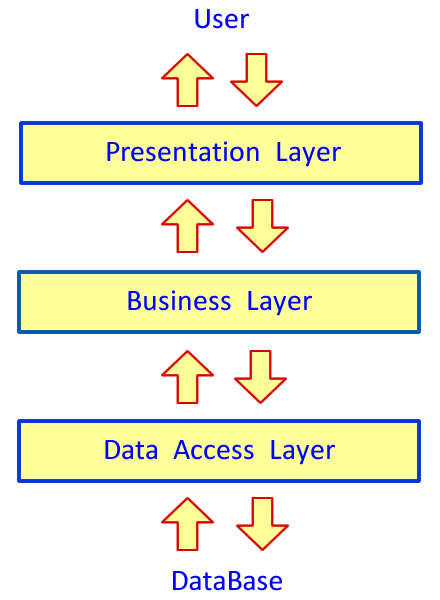
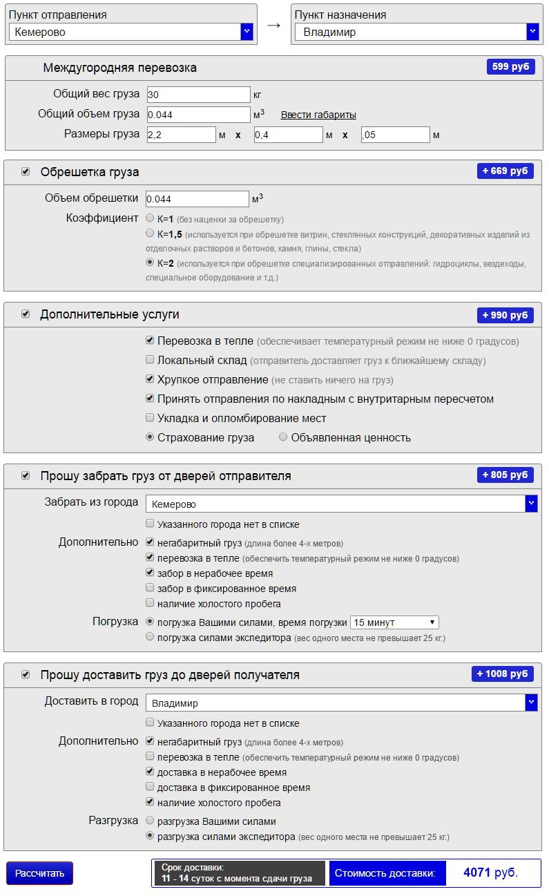

# CalcSustain
<b>N-layer</b> ASP.NET Web API 2 application using frameworks: <b>EntityFramewok</b>, <b>Ninject</b>, <b>Ninject.MVC5</b> and <b>Automapper</b>.

Some key code snippets only
 
This is a 3-layer ASP.NET Web API 2 contains <b>DAL</b>, <b>BLL</b> and <b>WEB</b> layers with this schema:

Authorization uses Oath2 specification based on OWIN and tokens with this schema:

Take a look at layers code: 

<b>DAL</b> (Data Access Layer): 
<ul>
	<li>EF: <a href="ERent.DAL/EF/RentContext.cs">RentContext.cs</a>,</li>
	<li>Entities: <a href="ERent.DAL/Entities/Salesman.cs">Salesman.cs</a>,</li>
	<li>Interfaces: <a href="ERent.DAL/Interfaces/IRepository.cs">IRepository.cs</a>,</li>
	<li>Repositories: <a href="ERent.DAL/Repositories/ApartmentRepository.cs">ApartmentRepository.cs</a>,</li>
	<li>Repositories: <a href="ERent.DAL/Repositories/SalesmanRepository.cs">SalesmanRepository.cs</a>,</li>
	<li>Repositories: <a href="ERent.DAL/Repositories/EFUnitOfWork.cs">EFUnitOfWork.cs</a></li>
</ul>

<b>BLL</b> (Business Logic Layer): 
<ul>
	<li>DTO: <a href="ERent.BLL/DTO/SalesmanDTO.cs">SalesmanDTO.cs</a>,</li>
	<li>Infrastructure: <a href="ERent.BLL/Infrastructure/ServiceModule.cs">ServiceModule.cs</a>,</li>
	<li>Infrastructure: <a href="ERent.BLL/Infrastructure/ValidationException.cs">ValidationException.cs</a>,</li>
	<li>Interfaces: <a href="ERent.BLL/Interfaces/IAdvertService.cs">IAdvertService.cs</a>,</li>
	<li>Services: <a href="ERent.BLL/Services/AdvertService.cs">AdvertService.cs</a></li>
</ul>

<b>WEB</b> (Presentation Layer): 
<ul>
	<li>App_Start: <a href="ERent.WEB/App_Start/NinjectWebCommon.cs">NinjectWebCommon.cs</a></li>
	<li>Controllers: <a href="ERent.WEB/Controllers/HomeController.cs">HomeController.cs</a>,</li>
	<li>Models: <a href="ERent.WEB/Models/SalesmanViewModel.cs">SalesmanViewModel.cs</a>,</li>
	<li>Util: <a href="ERent.WEB/Util/NinjectDependencyResolver.cs">NinjectDependencyResolver.cs</a></li>
</ul>

Here are some screenshots:

<b>HTML page for interact with this Web API2 application</b>:
 

